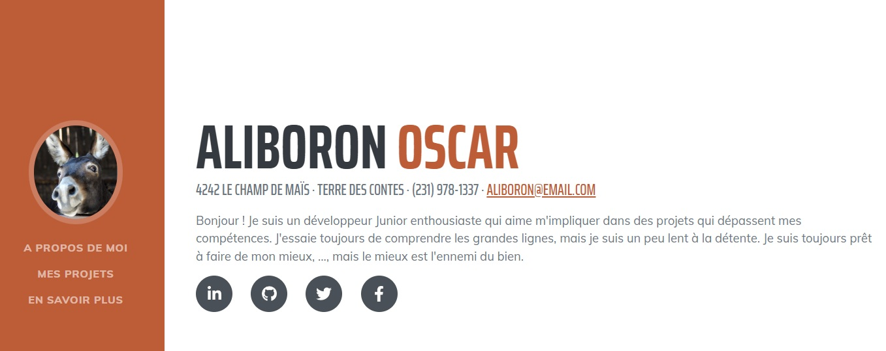

# CTF Web Serveur - Blog d'Aliboron

## Présentation du CTF 
**ID** 404 dans **les CTFs de Cyrhades**

Suite à l'invitation de la 3W Academy au salon Vivatech 2024, j'ai créé ce challenge de cybersécurité.

## Aperçu

## Vidéo 
[Mon Interview au salon Vivatech](https://www.youtube.com/watch?v=CbKcH7Oc7BA)

## Installation manuel
Vous n'utilisez pas l'application **les CTFs de Cyrhades** ? C'est dommage !
Mais voici comment installer ce CTF manuellement :

> git clone https://github.com/Hack-Oeil/ctf_vivatech.git

> cd ctf_vivatech

> docker compose up